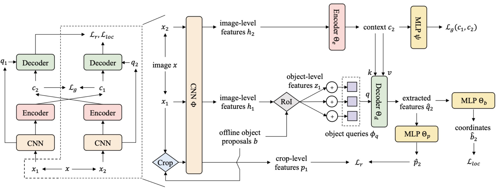

# Siamese DETR

By Zeren Chen, Gengshi Huang, Wei Li, Jianing Teng, Kun Wang, Jing Shao, Chen Change Loy, Lu Sheng.

This repository is an official implementation of the paper [Siamese DETR](https://arxiv.org/abs/2303.18144).

## Introduction

We propose Siamese DETR, a novel self-supervised pretraining method for DETR. With two newly-designed pretext tasks, we directly locate the query regions generated by Edgeboxes in a cross-view manner and maximize cross-view semantic consistency, learning localization and discrimination representation transfer to downstream  detection tasks.

<div align="center"></div>


## Preliminary

#### 1. Enviroment Requirements

This code is implemented based on [MMSelfSup](https://github.com/open-mmlab/mmselfsup) codebase. We test the code with python 3.6, pytorch 1.8.1, CUDA 9.0 and CUDNN 7.6.5. Other requirements can be installed via:

```bash
pip install -r requirements/runtime.txt --user
```

#### 2. Deformable Attention

Compile wheel following [Deformable DETR repo](https://github.com/fundamentalvision/Deformable-DETR).

#### 3. Offline EdgeBoxes

You can generate offline EdgeBoxes via:

```bash
cd tools/hycplayers
pip install -r requirements.txt --user

sh run.sh <YOUR_PARTITION> <NUM_PROCESS> <PATH/TO/DATA/ROOT> <PATH/TO/DATA/META> <PATH/TO/SAVE/DIR> <DATASET>  # <DATASET> should be imagenet or coco 
```

#### 4. SwAV Pretrained Backbone

Siamese DETR use a frozen SwAV backbone to extract feature. You can download SwAV pretrained backbone (800_ep@75.3 top1) from [SwAV repo](https://github.com/facebookresearch/swav).

#### 5. Create Soft Link

We provide coco-style PASCAL VOC meta files (See `data/datasets/voc_meta`) for downstream finetuning.

Put them into voc directory.

```bash
mkdir -p data/datasets/edgebox

ln -s path/to/swav/backbone data/model_zoo/resnet/swav_800ep_pretrain_oss.pth.tar

# dataset
ln -s path/to/coco2017 data/datasets/mscoco2017
ln -s path/to/imagenet data/datasets/imagenet
ln -s path/to/voc data/datasets/voc
cp -rf data/datasets/voc_meta data/datasets/voc/meta

# edgebox
ln -s path/to/imagenet/edgebox data/datasets/edgebox/imagenet
ln -s path/to/coco/edgebox data/datasets/edgebox/coco
```

#### 6. Downstream Preparation

We provide an example for downstream finetining, i.e., Conditional DETR in `downstream_finetune/conditionaldetr`.

The primary modifications compared to original repo includes:

* Add `--pretrain` arguments to load Siamese DETR pretrained checkpoint. (See [main.py](downstream_finetune/conditionaldetr/main.py) L160-168)

* Add PASCAL VOC datasets. (See [voc.py](downstream_finetune/conditionaldetr/datasets/voc.py)) 

## Usage

```bash
# upstream pretraining on ImageNet/COCO
# You can check work_dirs/selfsup/siamese_detr/<cfgs>/<time>.log.json for training details.
sh tools/srun_train.sh <PARTITION> <CONFIG> <NUM_GPU> <JOB_NAME>  

# convert openselfsup (OSS) checkpoint to detr checkpoint
python tools/convert_to_detr.py --ckpt <OSS_CKPT> --export <SAVE_DIR> [--deform]

# downstream finetune
cd downstream_finetune/<DETR_VARIANTS_DIR>
sh [train_coco.sh|train_voc.sh] <PARTITION> <CONVERTED_CKPT> <NUM_GPU> <JOB_NAME>
```

## Model Zoo

We provide pretrained checkpoints [here](https://github.com/Zx55/SiameseDETR/releases/tag/v0.1).

**Transfer results on ImgNet -> COCO** (We report AP in downstream benchmark)

<table>
  <thead>
    <th>Method</th>
    <th>Vanilla</th>
    <th>ConditionDETR-100q</th>
    <th>DeformableDETR-MS-300q</th>
  </thead>
  <tbody>
    <tr>
      <td>from scratch</td>
      <td>39.7</td>
      <td>37.7</td>
      <td>45.5</td>
    </tr>
    <tr>
      <td>UP-DETR</td>
      <td>40.5</td>
      <td>39.4</td>
      <td>45.3</td>
    </tr>
    <tr>
      <td>DETReg</td>
      <td>41.9</td>
      <td>40.2</td>
      <td>45.5</td>
    </tr>
    <tr>
      <td>SiameseDETR</td>
      <td>42.0</td>
      <td>40.5</td>
      <td>46.4</td>
    </tr>
  </tbody>
</table>

**Transfer results on ImgNet -> PASCAL VOC**

<table>
  <thead>
    <th>Method</th>
    <th>Vanilla</th>
    <th>ConditionDETR-100q</th>
    <th>DeformableDETR-MS-300q</th>
  </thead>
  <tbody>
    <tr>
      <td>from scratch</td>
      <td>47.8</td>
      <td>49.9</td>
      <td>56.1</td>
    </tr>
    <tr>
      <td>UP-DETR</td>
      <td>54.4</td>
      <td>56.9</td>
      <td>56.4</td>
    </tr>
    <tr>
      <td>DETReg</td>
      <td>57.0</td>
      <td>57.5</td>
      <td>59.7</td>
    </tr>
    <tr>
      <td>SiameseDETR</td>
      <td>57.4</td>
      <td>58.1</td>
      <td>61.2</td>
    </tr>
  </tbody>
</table>

**Transfer results on COCO -> PASCAL VOC**

|Method|ConditionDETR-100q|
|:----:|:----:|
|from scratch|49.9|
|UP-DETR|51.3|
|DETReg|55.9|
|SiameseDETR|**57.7**|

## License

Siamese DETR is released under the Apache 2.0 license. Please see the LICENSE file for more information.

## Citation

```
@article{chen2023siamese,
  title={Siamese DETR},
  author={Chen, Zeren and Huang, Gengshi and Li, Wei and Teng, Jianing and Wang, Kun and Shao, Jing and Loy, Chen Change and Sheng, Lu},
  journal={arXiv preprint arXiv:2303.18144},
  year={2023}
}
```
